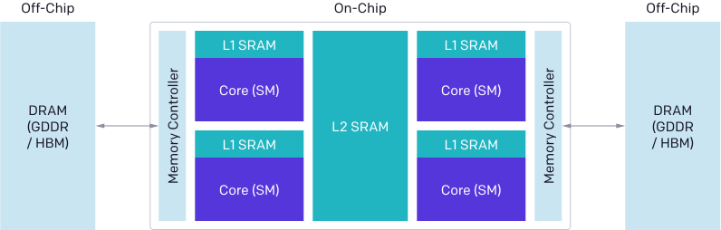

## CUDA
### CUDA编程模型：

- **Grid**
- **Block**
- **Thread**
Grid由多个Block组成，而Block由多个线程组成

- **Shared Memory**：on-chip
属于 SM，供 **同一个 Block 的线程共享**，访问速度接近寄存器，远快于全局内存，大小一般为 **48KB 或 96KB**，与 L1 Cache 通常**共享物理空间**
- **L1 Cache**：
L1 Cache与Shared Memory共享硬件资源，在CUDA编程中共享内存通过`__shared__`声明
- **L2 Cache**：
所有SMs共享，处在HBM和SMs之间
可以将L2 Cache中的一部分预留出来用于持久化访问全局内存中的数据
- **Local Memory**
地位与全局内存相同，也会在L2 Cache中缓存
```C++
cudaGetDeviceProperties(&prop, device_id);
size_t size = min(int(prop.l2CacheSize * 0.75), prop.persistingL2CacheMaxSize);
cudaDeviceSetLimit(cudaLimitPersistingL2CacheSize, size); /* set-aside 3/4 of L2 cache for persisting accesses or the max allowed*/
```

Local memory is cached in L1.

在调用CUDA核函数时，需要指定
`kernel<<<grid, thread_per_block>>>` Grid和Block的形状
其中Grid可以认为是总的任务数量，


### Automatic Scalability
自动

#### 共享内存案例：

https://docs.nvidia.com/cuda/cuda-c-programming-guide/index.html#shared-memory


### 线程调度

#### SM
一个Block是分配在一个SM（Stream Multiprocessor）上执行的
- 一个 SM 可以同时运行多个 Block（具体数量取决于资源：register 数、shared memory、warp 数量等）
- 一个 Block 不会被拆分到多个 SM 上

#### warp
- 一个 warp（线程束）就是 GPU 中调度和执行的基本单元，**固定为 32 个线程**。这 32 个线程**同时执行同一条指令**（SIMT 模型）。
- 一个warp是32个线程，是线程调度的基本单位，所以一般情况下每个block的线程数取128，256,512,1024等32的倍数

一般是先根据任务特点选择一个
`threads in [128, 256, 512, 1024]`
然后根据任务的大小，比如输入或输出的Tensor大小，确定
`num_blocks= ceil(size // threads)`


### L2 缓存优化案例

### CUDA Stream

如果不指定stream，CUDA会使用默认stream执行，此时的kernel执行操作是同步的，CPU在kernel执行结束之前不会执行下一条指令

如何使用多stream实现通信计算Overlapping？


### CUDA Graph是什么

### 主要功能和优势：

1. **减少 CPU 启动开销 (Launch Overhead Reduction)**：
    
    - 在传统的 CUDA 编程中，每一个核函数的启动或内存拷贝操作都需要 CPU 发送一个指令到 GPU。当有大量短小的 GPU 操作时，CPU 启动这些操作的开销（latency）可能会累积起来，成为性能瓶颈。
    - CUDA Graph 解决了这个问题。通过将一系列 GPU 操作捕获为一个图，CPU 只需要一次性地提交整个图的执行指令，极大地减少了 CPU 和 GPU 之间的交互次数，从而降低了启动开销。这对于短时、频繁执行的核函数尤其有效。
2. **提高 GPU 利用率和吞吐量 (Increased GPU Utilization and Throughput)**：
    
    - 由于减少了 CPU 的干预，GPU 可以更高效地连续执行图中的操作，减少了 GPU 处于空闲状态的时间，从而提高了 GPU 的利用率和整体吞吐量。
    - 特别是在深度学习推理等静态工作负载中，同一个计算图可能需要被重复执行多次，CUDA Graph 的创建开销可以被分摊到多次执行中，带来显著的性能提升。
3. **优化执行路径 (Optimized Execution Path)**：
    
    - 当一个图被捕获后，CUDA 驱动程序可以获得所有操作及其依赖关系的完整描述。这使得驱动程序能够对图的执行进行更深层次的优化，例如调整操作的顺序、合并不必要的同步点等，以实现更优的执行效率。
4. **支持动态控制流 (Dynamic Control Flow with Conditional Nodes)**：
    
    - 虽然 CUDA Graph 最初主要用于静态工作流，但较新版本的 CUDA 引入了条件节点（Conditional Nodes）等特性，允许在图内部实现一定的动态控制流，而无需将控制权返回给 CPU。这使得一个图能够表示更复杂的工作流，进一步减少 CPU 开销。
5. **内存管理优化 (Memory Management Optimization)**：
    
    - 在图中，CUDA 驱动程序可以更智能地管理内存。例如，对于生命周期不重叠的内存分配，CUDA 可以重用相同的物理内存，甚至可以在不同的图之间通过虚拟地址别名来共享物理内存，从而提高内存利用效率。

### 常见显卡的各项参数

表格：：：：

线程调度：
SM数， CUDA core数


### FlashAttention的案例

softmax公式：
有向量$x\in \mathbb{R}^K$


$$softmax(x_i)=\frac{e^{x_i}}{\sum_{k=1}^{K}e^{x_k}}$$

普通实现：
```
import torch
N=100
x = torch.empty(N, N)

```

### FlashAttention中为了实现数值稳定性(numerically stabilized)
使用一个变量$l$保存分母，每次循环取出KV的N行和Q的M行进行操作
$S_{ij}=Q_iK^T_j$


求出前n块的最大值（为了数值稳定性）
分块分别求出分母,
其中，O用于保存分子，l用于保存分母，
每一轮运算都要将O加载出来用于读取和 写入

为了数值稳定性（浮点数的性质），softmax中将所有的值都除以max

$$l^{new}_i = emi mnew  i li  ̧ em ̃i j mnew  i l ̃i j 2 RBr .$$

### 单个Thread最多利用多少SRAM资源

#### 总结：单个线程最多使用多少 SRAM？

| 类型  | 描述                        | 大致上限 |
| --- | ------------------------- | ---- |
| 寄存器 | 私有，每个线程最多可用 ~255 个（32bit） | ~1KB |
### CUDA与Triton的区别
在 **CUDA 编程中，HBM（全局内存）中的数据访问是隐式的**，你只需要使用指针或数组访问即可，不需要显式调用像 `tl.load()` 这样的函数。但在 **Triton 中，`tl.load()` 是必须显式调用的**，因为 Triton 是基于 MLIR 的中间表示系统，需要你显式描述内存访问。
## Triton


- **定位与背景**
    
    - OpenAI 开源，为了简化 GPU kernel 的编写
        
    - 对标 CUDA：更加易用，面向 tensor 编程
        
- **Triton 编程模型**
    
    - 用 Python 写 GPU kernel
        
    - 强类型系统 + 矩阵化思维
        
    - 编译时重排 + 矢量化自动处理
        
- **和 PyTorch 的关系**
    
    - Triton 可集成 PyTorch 作为 kernel 替代
        
    - 被 PyTorch 2.0 的 `torch.compile()` 动态调用（TorchDynamo + Triton 后端）


### L2 Cache Optimization

