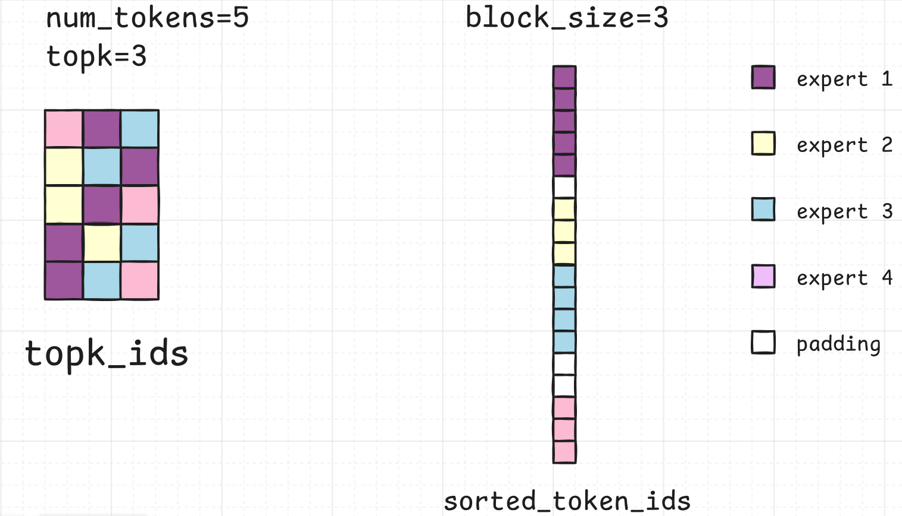

## vllm中FusedMoE的相关细节介绍
### 阶段1： DP广播
若使用了DP，则在DP组内广播，此时所有的计算节点拥有相同的token
### 阶段2:   moe_align_block_size(padding)
**输入**：**`(topk_ids, expert_map=None)`**

- `topk_ids`是一个`shape = (num_tokens, topk)`的张量，`topk_ids[i]`表示第`i-1`个token路由到的`topk`个专家id

- `expert_map` 是一个从全局专家id到本地专家id的映射，将全局专家id映射到本地专家id，在启用专家并行时传入此参数

**输出**：
- **`num_tokens_post_padded`:int**

	padding操作之后的token总数（完全不padding的情况下这个值为`topk * num_tokens`）,padding之后保证每个专家处理的token数都能被`block_size`整除

- **`sorted_token_ids`:torch.Tensor**

	`shape = (num_post_padding, )`
	按照专家id排序，并对每个专家处理的token数量进行padding后的token索引（此索引表示该token在`topk_ids`中的位置）
	
	下图是`expert_size=4, block_size=3`的案例，此处的num_tokens_post_padded=18

> [!Important]
> 这里说是按专家id进行排序，但是实际没有排序的逻辑（排序开销太大），`sorted_token_ids`是通过索引计算生成的，通过计算当前token前面有多少token来确定该toekn在`sorted_token_ids`中的位置
- **`expert_ids`:torch.Tensor**

	`shape = (num_post_padding, )`
	`sorted_token_ids`每个位置对应的专家id，用于在kernel中确定待处理的token是否属于本地专家，如果不属于，则向输出矩阵中写入0,代码如下所示
```Python
off_experts = tl.load(expert_ids_ptr + pid_m).to(tl.int64)
if off_experts == -1:
	# -----------------------------------------------------------
	# Write back zeros to the output when the expert is not
	# in the current expert parallel rank.
	write_zeros_to_output(c_ptr, stride_cm, stride_cn, pid_n, N,
	offs_token, token_mask, BLOCK_SIZE_M,
	BLOCK_SIZE_N, compute_type)
	
	return
```

### 阶段3: GEMM计算

1. 在Triton kernel中遍历`sorted_token_ids`，与`w13`权重进行计算
2. 将`1.`的输出与权重`w2`的矩阵运算得到最终的结果，最后计算与`topk_weights`的乘积
3. `moe_sum`，将计算结果转化为原始的token
	这一步的流程是：可以简单理解为对上一步的输出（shape=(num_tokens, topk, hidden_size)）进行一个`torch.sum(input, dim=1)`的操作
> [!Note]
>这里步骤1和2的输出矩阵初始化时都没有使用`torch.zero`而是使用了`torch.empty`，所以不能默认没有写入的位置是0,对于本地专家没有路由到的位置需要写入0


### 阶段4: allreduce

先进行 DP 组内的 allreduce，只保留本地 token 的结果

```python
if self.dp_size > 1:
	start = 0 if self.dp_rank == 0 else cu_tokens_across_dp_cpu[
		self.dp_rank - 1]
	end = cu_tokens_across_dp_cpu[self.dp_rank]

	all_hidden_states = get_dp_group().all_reduce(final_hidden_states)
	final_hidden_states = all_hidden_states[start:end, :]
```

再进行 TP 组内的 allreduce